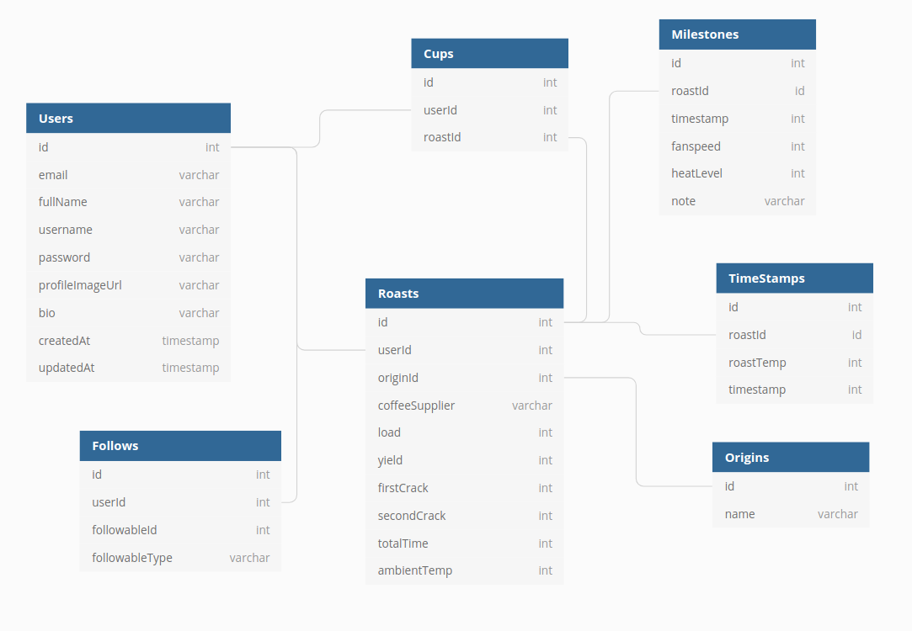
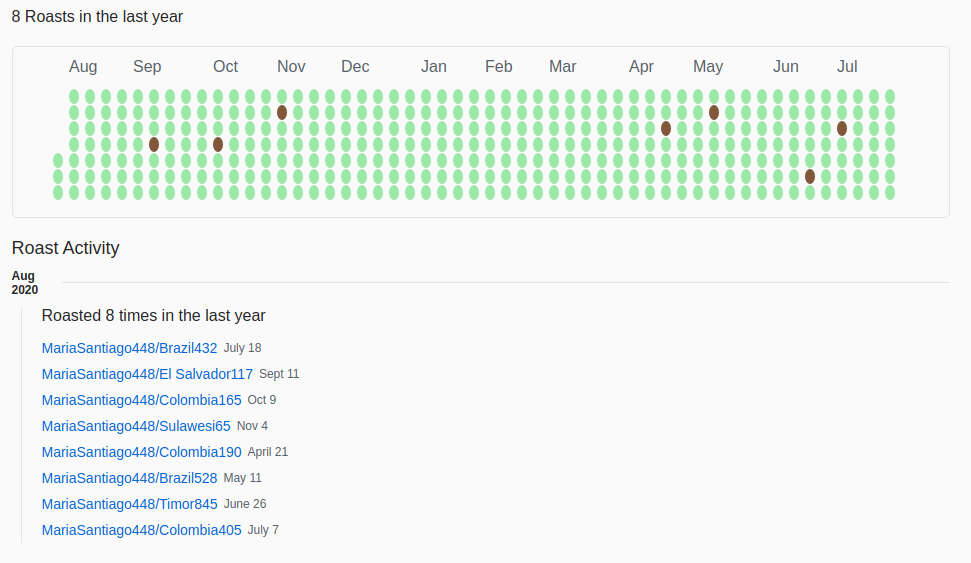
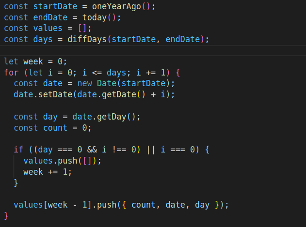

# CoffeeHub
*By [James Robertson](http://jamesurobertson.com/) - [Live site](https://coffee-hub.herokuapp.com/)*

A Platform built for coffee roasting.

**Table of Contents**
  * [CoffeeHub at a Glance](#CoffeeHub-at-a-glance)
  * [Technologies Used](#technologies-used)
  * [Application Architecture](#application-architecture)
  * [Frontend Overview](#frontend-overview)
  * [Backend Overview](#backend-overview)
  * [Conclusion](#conclusion)

## CoffeeHub at a Glance
CoffeeHub is a full stack coffee roasting platform for home roasting enthusiasts to create, store, and share their different roasts.

The application is made with a React frontend utilizing styled-components.
The backend is a Python Flask server with a PostgreSQL database.

**Key Features**
* User sign in / sign up with JWT authentication and encrypted password with werkzeug
* Tools to aid you during the roasting process
* Follow other users / cup (star) other roasts
* Dynamic searching based off username, roast name, or bean origin
* Dynamic and clickable roast 'garden' modeled after GitHub's repository 'garden'
<!--
 -->

## Technologies Used
* Frontend
  * React
  * Javascript
  * Styled-Components
  * Rechart / D3
  * react-hook-form
  * react-toastify
* Backend
  * Flask
  * Python
  * Postgres
  * SQLAlchemy
  * Alembic
  * AWS S3
  * Heroku deployment via Docker

## Application Architecture
The frontend is a `create-react-app` using functional components with hooks. The backend is a Flask server with various RESTful endpoints. They are deployed via Docker to a Heroku server.

##### CoffeeHub Postgres database schema

## Frontend Overview
The front end is fully mobile response and styling is modeled after GitHub and uses styled-components. I implemented a custom component library for all of my buttons, inputs, widgets, and feedcards to keep styling the same and DRY up my code base.

For the roast garden I manipulated the JavaScript Date class to dynamically create the clickable garden based off the current date. Here is an exmaple of how it looks and some of the code to create the chart. The functions to manipulate the date class can be found in src > utils > garden

## Backend Overview
The Flask backend is a collection of RESTful routes serving data to the frontend and an interface with the Postgres database.

The database is queried using the SQLAlchemy ORM, and seed data was added using the Alembic library.

Images were hosted in an Amazon S3 bucket and implemented using awscli library.

## Conclusion
CoffeeHub was a passion project of mine that was created to solve a problem. One of my hobbies is coffee roasting and when I first started roasting I didn't have a great system in place to keep track of all my different roasts, I was recording them all on pen and paper! I also couldn't find a platform online to aid me in my roasting or to easily find different roast profiles whenever I bought new green beans. To solve this problem, I built coffeeHub.

Future features would include a fully operation explore page that is scoped beyond my current search page, and adding user comments and multimedia to different roasts.
